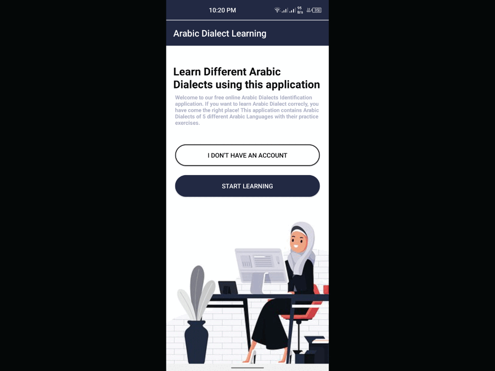

# Arabic Dialect Identification

# Overview
Developed an AI-based application for accurately identifying five distinct Arabic dialects (𝐄𝐠𝐲𝐩𝐭𝐢𝐚𝐧, 𝐋𝐞𝐯𝐚𝐧𝐭𝐢𝐧𝐞, 𝐆𝐮𝐥𝐟, 𝐍𝐨𝐫𝐭𝐡 𝐀𝐦𝐞𝐫𝐢𝐜𝐚𝐧, 𝐚𝐧𝐝 𝐌𝐨𝐝𝐞𝐫𝐧 𝐒𝐭𝐚𝐧𝐝𝐚𝐫𝐝 𝐀𝐫𝐚𝐛𝐢𝐜) using cutting-edge techniques in Natural Language Processing (NLP) and fine-tuned models.

# Demo 

# References
<b>Github Link: </b> https://github.com/ARBML/klaam
